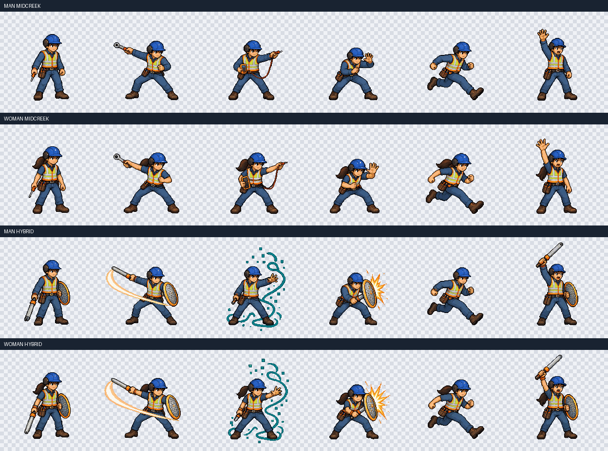

# Midcreek Hero

Pixel-art and character-direction experiments for Midcreek.

## Godot hello world

**[Open the web viewer](https://ridermw.github.io/midcreek-hero/)**

A minimal viewer shows one of the 24 current individual hero sprites at a time.
Press **Space** to advance; after the last image it wraps to the first.
Holding Space does not skip through images. The caption identifies the
character, variant and pose.

Uses Godot 4.7.2, GDScript, nearest-neighbor sprite filtering, the Compatibility
renderer, and a single-threaded Web export. The viewer reads the existing
sprite manifest.

Open `project.godot` in Godot and press F5, or export and preview in a browser:

```sh
godot --headless --editor --path . --import
mkdir -p build/web
godot --headless --path . --export-release Web build/web/index.html
python3 -m http.server 18765 --bind 127.0.0.1 --directory build/web
```

Open `http://127.0.0.1:18765/`. If necessary, click the game once to give it
keyboard focus. Install the matching Godot export templates before exporting.
The complete `build/web/` folder is suitable for static hosting on GitHub Pages;
it needs no backend or cross-origin-isolation headers. The
`Godot web viewer` workflow imports, tests, and exports on pull requests,
then deploys successful builds from `main` to GitHub Pages. Generated builds
are ignored by Git rather than committed.

Run the sprite-loading and keyboard-cycle checks:

```sh
godot --headless --path . --script tests/viewer_test.gd
```

## Cel Shift pixel sprites

The current [sprite set](art/cel-shift/sprites/README.md) contains normal and
hybrid male/female variants, four transparent sheets, and 24 individual sprites.
Normal technicians use real tools without fantasy effects. Hybrids retain the
industrial sword/shield silhouettes and effects.



## Animated data hall checkpoint

The `game/world.tscn` scene adds two technicians, local rack repair, camera
tracking, and three environment layers. It requires all seven authored
animation clips for each technician. Only the man's idle and walk clips are
complete. The scene reports missing artwork instead of using static sprites.
The sprite viewer remains the main scene.

Install the asset-tool dependency and normalize the checked-in environment
sources:

```sh
python3 -m pip install -r tools/requirements.txt
python3 tools/environment_assets.py normalize
```

Use `--layer far`, `--layer equipment`, or `--layer floor` to normalize one
layer. The command writes `environment/layers/` under `art/cel-shift/`.
It uses nearest-neighbor sampling. Far and equipment layers become 640x360.
The floor strip becomes 640x96. The equipment layer uses binary alpha.
Source dimensions and transparency must match the layer contract.

All animation prompts use the existing idle/walk geometry: 512x512 source
cells, a boot baseline at y=448, and a standing height of approximately 270
pixels. Keep this geometry when generating the remaining clips. The
normalizer uses one fixed 512-to-171 scale and writes 208x208 frames.
Ponytail guidance applies only to the woman. The normalizer checks all frame
hashes before it writes files, so duplicate artwork cannot overwrite prior
frames or previews.
After generating and normalizing all clips, run:

```sh
python3 tools/animation_assets.py manifest
godot --headless --editor --path . --import
godot --headless --path . --script tests/world_test.gd
```

Both runtime JSON manifests are included explicitly in Web exports.
Generated source sheets and previews are excluded from Web exports.
Local primary and diagnostic actions face the rack when it is in range.
Run the asset-pipeline regression checks with:

Install ffmpeg on your PATH first. The audio conversion regression test
uses its native Vorbis encoder. CI installs ffmpeg before running this suite.

```sh
python3 -m unittest discover -s tests -p 'test_*.py'
godot --headless --path . --script tests/environment_test.gd
godot --headless --path . --script tests/local_action_test.gd
```

CI also opens the exported resource pack from outside the project directory.
It checks that runtime textures remain available and source-art directories
are absent.

## Play

Open the [web build](https://ridermw.github.io/midcreek-hero/) or run
`godot --path .`. The game starts on the title screen. Choose a technician,
then choose a work order. Finish every required task before the SLA timer
reaches zero, then reach the exit door.

| Action | Keyboard | Gamepad |
|---|---|---|
| Run | A and D, or the arrow keys | Left stick or D pad |
| Jump | Space | A |
| Climb a ladder | W or Up, S or Down | Left stick or D pad |
| Slide | C or Shift | B |
| Repair (hold) | E | X |
| Diagnose | Q | Y |
| Pause | Escape or P | Start |

## Levels

| # | Name | New mechanics | Hazards |
|---|---|---|---|
| 1 | Cold Aisle Onboarding | Run, jump, repair | Cable snags, open floor tiles |
| 2 | Hot Aisle | Fetch a PSU or DIMM, diagnose then repair | Heat vents (1.5 s off, 0.4 s warning, 1.0 s on) |
| 3 | Cable Jungle | Slide under trays, ladders, wall jump, reseat a cable | Moving cable snags |
| 4 | Power Room | Ride lifts, reboot a switch in order | Spark arcs (1.4 s off, 0.5 s flicker, 0.6 s on) |
| 5 | Outage Night | Darkness with a flashlight, every task type, a 4 rack row | Patrol drones (slide under them), all earlier hazards |

Work order types: hold E to repair a red rack. For a fetch order, run over the
spare part, then hold E at the rack that shows the part icon. For a diagnose
order, press Q at the rack with the amber marker, then hold E. To reseat a
cable, press E at the port, then press each button the HUD shows within 1 s.
To reboot a switch, press E at switch panels 1, 2, and 3 in that order; a wrong
panel turns them all off. Stand on a lift to ride it 3 tiles up. Slide under a low tray; the slide continues until there is room to stand. Press
into a wall in the air to slow your fall, and jump to kick off it. A restart at a
checkpoint undoes pickups, diagnoses, repairs, cable reseats, and switch throws
made after that checkpoint.

Progress (stars, best times, unlocked levels, and the chosen technician) is
saved in `user://save.json`. On the web this is browser storage.

Each level has a route file in `levels/routes/`. `tests/route_test.gd` plays every
route at a fixed 60 frames per second and checks that it finishes without a
restart.

    tools/godot_test.sh tests/route_test.gd ROUTE_TEST

A test can request engine flags with a first line such as
`# godot_test_args: --fixed-fps 60`.

Route steps accept only `tap`, only `wait`, or `hold` with `seconds` or a target
(`until_x` or `until_y`) and `max_seconds`. A target needs exactly one matching
direction: left or right for x, up or down for y. Extra fields are rejected rather
than ignored.

## Core platformer

The gray box level tests movement, health, the SLA timer, repair tasks,
checkpoints, and the exit. It uses flat colors. Generated art comes in M1.

    godot --path . res://game/level.tscn

Controls: A and D or the arrow keys to run, Space to jump, hold E to repair.
A gamepad uses the left stick or D pad, A to jump, and X to repair.

Run one core test:

    tools/godot_test.sh tests/level_test.gd LEVEL_TEST

Level files are in `levels/`. `levels/LEGEND.md` describes the format.

## Game art pipeline

All game art is generated with MockUI and normalized to binary alpha pixel
frames. Each asset group (technician animations, tiles, hazards, props, ui)
shares one palette of at most 96 opaque colors.
The sprite normalizer rejects blank frames both before and after resizing,
including sparse artwork that disappears when its alpha is thresholded.
It validates the entire sequence before replacing previously normalized frames.

Technician clips: idle, walk, run, jump, slide, primary, secondary, reaction,
and signal for the man and the woman.

    python3 tools/animation_assets.py render --variant woman-midcreek --clip jump
    python3 tools/animation_assets.py normalize --variant woman-midcreek --clip jump
    python3 tools/sprite_assets.py palette --group animations
    python3 tools/animation_assets.py manifest

Tiles, hazards, props, and UI come from `art/cel-shift/catalog.json`. Each entry
has a cell size, a frame count, a `fit` mode, and a prompt.

    python3 tools/sprite_assets.py render --name rack-fault
    python3 tools/sprite_assets.py normalize --name rack-fault
    python3 tools/sprite_assets.py palette --group tiles
    python3 tools/sprite_assets.py manifest --group tiles

`fit` modes: `fill` stretches the drawn object to the cell, `top`, `bottom`, and
`center` keep its aspect ratio, and `canvas` scales the whole render.
