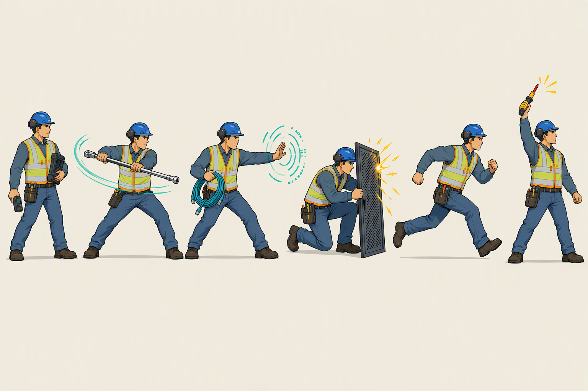
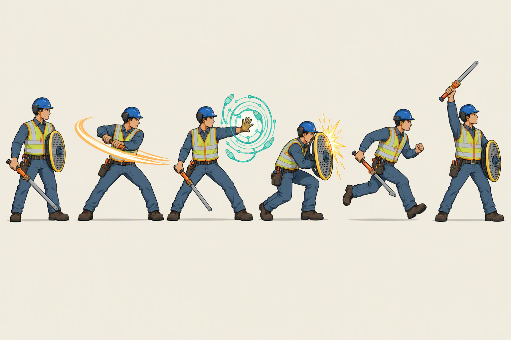
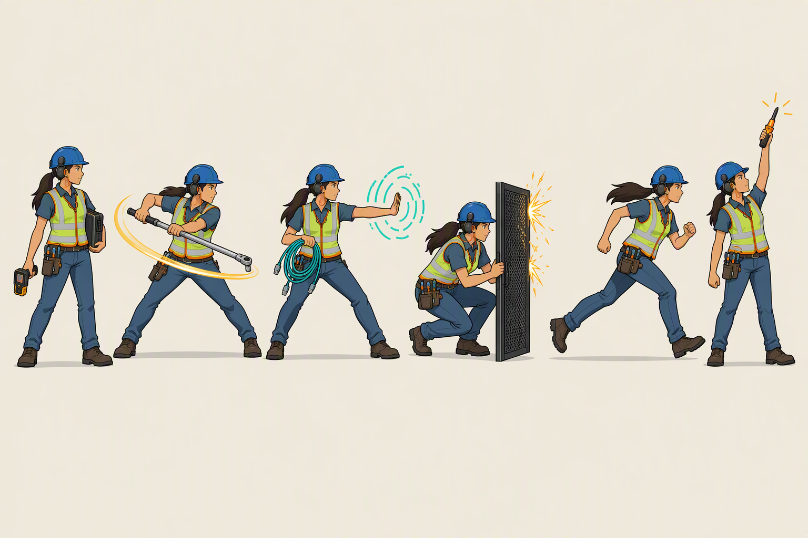
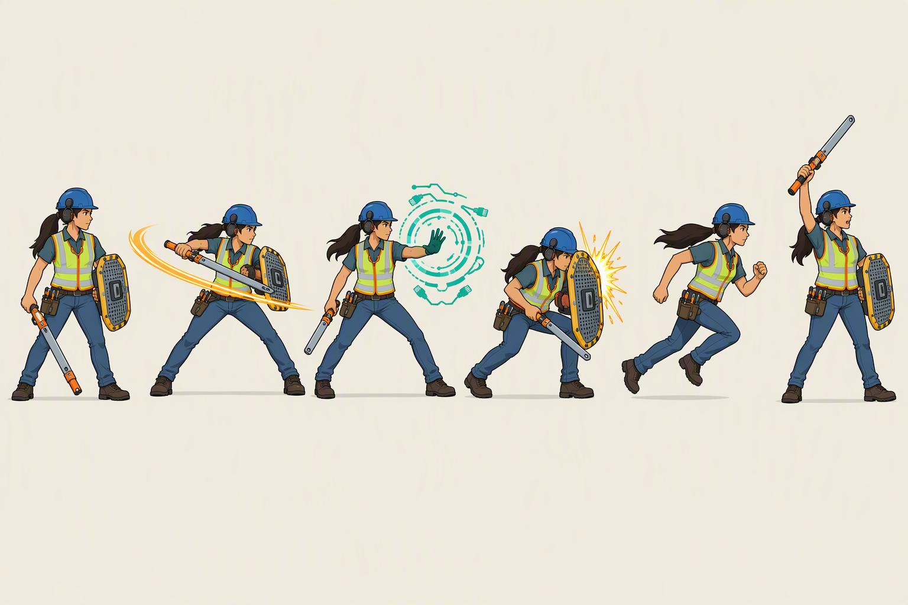

# Cel Shift six-pose study

This study applies the six silhouettes from an RPG sprite-sheet reference to
the canonical Cel Shift man and woman technicians.

The source `midcreek-concept` repository was treated as read-only. Its
character sheets were supplied to MockUI as visual references; no files were
changed there and no source assets were copied into this repository.

## Variants

| Character | Midcreek translation | Industrial-fantasy hybrid |
|---|---|---|
| Man |  |  |
| Woman |  |  |

The **Midcreek** variants translate the actions into diagnostic tools, service
cables, rack panels, and maintenance gestures. The **hybrid** variants retain
the source's sword-and-shield readability while redesigning the equipment as
an insulated extraction tool and a portable rack-access panel.

## Pose order

1. Ready stance
2. Sweeping action
3. Diagnostic-effect gesture
4. Braced block
5. Running stride
6. Raised-tool signal

Each image was generated at 1536×1024 with MockUI using
`gpt-image-2.5-flare`, high quality, whole-image editing, two numbered
references, and strict prompt screening. The RPG pose reference came from the
OpenAI image gallery; the generated images do not include the original sprite
sheet.

The four source prompts are in [`prompts/`](prompts/). MockUI metadata beside
each image records the full generation prompt, input hashes, model, and usage;
machine-specific account and absolute-path fields are removed before commit.
